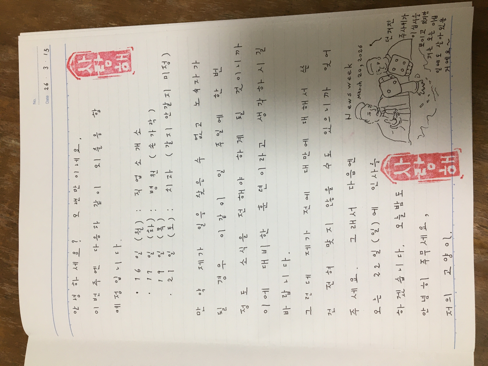

# weekly1

### 2026-03-15 

---- 

### 2026년 3월 12일 
- 저는 이태원 참사가 일어났을 2022년부터 매일 하루도 거르지 않고 인터넷을 통해 이같이 소식을 전해 왔지만 그 동안에 한 번도 당신을 본 적이 없었기 때문에 제가 해 온 이런 일이 소용없었을 수도 있다고 생각하고 있습니다. 그래서 (제가 이 삼 년 동안에 '그래서'라는 말을 사용한 건 아마 이가 처음인데요) 오늘부터 매일 이같은 글을 쓰는 걸 중지하고 한 주일에 한 번만 그 동안에 일어난 일에 대해 보고하기로 했습니다. 부엌 영상만 계속 낼 것인데요 부엌에서 만든 음식에 대해선 비공개로 하겠어요. 지금 저의 경제상태에선 잘 요리를 할 수 없고 저는 생사의 기로에 있기 때문에 이같이 하기로 했는데 당신이 이해해 주시길 바라고 있습니다. 아마 세상 사람들을 제가 죽었다고 생각할 것이지만 저는 전날까지 인터넷을 사용한 다음 죽는 것이 아니라 '제가 죽은 후의 세계'를 살아 있으면서 볼 수 있기 때문에 좋다고 하고 있습니다. 
- 上に韓国語で書いたように今後は週に一度(現時点では日曜日を想定しています)その週にあったことを報告するに留めそれ以外のインターネット上での活動を一切中止するつもりです。但し台所を撮影しアップロードする作業のみ当分の間は続けようと思います。(これまで通り早朝に行うかはまだ未定ですが)今回このようなことを決定した理由は上に述べたこと以外にも最近恐らくこの数年間私につき纏っていた呪縛のようなものが恐らく(少なくとも部分的には)解け、後は韓国の彼女側に私に対する好意が残っているかのみが焦点となるのではないかという気がする、ということもあります。この呪縛のようなもの(これは言うまでもなく両親のことです)の存在に気付いたのは仕事を辞めてからですが、恐らくこれが原因となって2022年までにアマゾン茨木センターにてある噂が生まれ、それが間接的な原因となって少なくとも彼女が退職するに至ったことは確実だと私は思っています。両親(肉親である父親とstepmotherである義母)が行ってきた策略については依然分析中ですが、私は彼女と結婚する・しないに関わらず両親と縁を切るつもりです。今回肉親である母親の戸籍附票を見て思ったのは恐らく肉親である母親は私の味方となってくれる可能性があるということです。私は父方の財産の相続権を放棄する代わりに縁を断つつもりですが、韓国の彼女やご両親は(これまでのことが伝わっていれば)大賛成して下さると思っています。 
